# Volta\Component\Books
Website  given a Book written in the Volta Book Format(VBF) 

## Features
- A portable Book Format
- Customizable parsers

##
A component which wil treat a collection of directories with a content file and containing resources as a Book. Where each
directory or resource is considered a Node in the Book(the Book itself is also a Node). To render a specific type of content(i.e. HTML or plain text) a renderer or parser for that type must be registered. A **`ContentRenderer'**. Volta provides the following Renderers
 
* HTML (`content.html` | `content.htm`)
* XHTML (`content.xhtml`)
* PHP- (`content.php` | `content.phtml`)
 
A directory containing a file named `content.*` and a file named `meta.json` is considered a **`DocumentNode`**. If the **`DocumentNode`** has no parent **`DocumentNode`** the **`Node`** is considered a **`BookNode`**. A **`DocumentNode`** is identified by the absolute path of the directory. Resources like images, videos etc. are of type **`ResourceNode`** and will be identified by the absolute path of the file and must reside in a the containing **`DocumentNode`** .

To get a **`Node`**, any **`Node`**, we pass the (absolute) path to the `Node::factory()` or the relative path to the `Node::getChild()` method of a **`Node`** instance. These methods will return a valid **`Node`** or will raise an Exception if the path does not contain a **`Node`**.

```php
<?php
/**
 * Start the PHP webserver in this directory with the like:
 *
 *  php -S localhost:8080 index.php
 *
 * this way the index.php wil act as a front controller and will serve
 * all the resources as well
 */
declare(strict_types=1);

ini_set('display_errors', 1);
ini_set('display_startup_errors', 1);
error_reporting(E_ALL);

require_once __DIR__ . '/../../vendor/autoload.php';

try {
    $bookName = 'Book';
    $bookshelf = new Volta\Component\Books\BookCase();
    $bookshelf->addBook(__dir__ . '/../' . $bookName);
    $book = $bookshelf->getBook($bookName);
    $page = $_SERVER['REQUEST_URI'];
    $node = $book->getChild($page);
    if (is_a($node, Volta\Component\Books\ResourceNode::class)) {
        if ($node->getContentType() ===  Volta\Component\Books\ResourceNode::MEDIA_TYPE_NOT_SUPPORTED) {
            header('HTTP/1.0 415 Media-type not supported');
            exit();
        }
        header('Content-Type: ' . $node->getContentType());
        header("Content-Length: " . filesize($node->getAbsolutePath()));
        readfile($node->getAbsolutePath());
        exit();
    }

} catch(\Throwable $e) {
    exit($e->getMessage());
}
?>
<!DOCTYPE html>
<html lang="en">
<head>
    <meta charset="UTF-8" />
    <title>Volta Component Books Example</title>
    <meta name="viewport" content="width=device-width,initial-scale=1" />
    <meta name="description" content="" />
    <link rel="icon" href="favicon.png">
</head>
<body style="margin:auto; width:800px;padding:20px;">
    <nav style="display:flex; justify-content: space-between">
        <?php if(null !== $node->getPrevious()): ?>
            <?php if(null !== $node->getPrevious()->getParent()): ?>
                <a href="<?= $node->getPrevious()->getUri(false);?>"><?= $node->getPrevious()->getName();?></a>
            <?php else: ?>
                <a href="/"><?= $node->getPrevious()->getName();?></a>
            <?php endif; ?>
        <?php else: ?>
            <div></div>
        <?php endif; ?>
        <?php if(null !== $node->getNext()): ?>
            <a href="<?= $node->getNext()->getUri(false);?>"><?= $node->getNext()->getName();?></a>
        <?php else: ?>
            <div></div>
        <?php endif; ?>
    </nav>
    <?php echo $node->getContent(); ?>
</body>
</html>

```

This [Volta Framework Manual](http://localhost:8080/books/Volta-Manual) is such a book.


[//]: # (Start Volta\Component\UmlDoc\MermaidDiagram)

```mermaid
classDiagram
    class Volta_Books_BookNode
    Volta_Books_DocumentNode<|--Volta_Books_BookNode
    class Volta_Books_DocumentNode {
        #array _children
        #string _contentFile
        #Volta\Component\Books\Meta _meta
        #?Volta\Component\Books\NodeInterface _next
        #?Volta\Component\Books\NodeInterface _previous
        +getChildren():array
        +getContent():string
        +getContentAsStream():Psr\Http\Message\StreamInterface
        +getContentFile():string
        +getContentType():string
        +getMeta():Volta\Component\Books\Meta
        +getNext():?Volta\Component\Books\NodeInterface
        +getPrevious():?Volta\Component\Books\NodeInterface
    }
    class Volta_Books_Meta {
        #array _metadata=[0..*]
        +__construct(?string file=NULL)
        +equals(string key, mixed value):bool
        +get(string key, mixed default=NULL):mixed
        +has(string key):bool
        +set(string key, mixed value, bool overWrite=false):static
    }
    Volta_Books_DocumentNode *-- Volta_Books_Meta : #_meta
    class Volta_Books_NodeInterface {
         	&lt;&lt;interface&gt;&gt;
        +getAbsolutePath():string
        +getChildren():array
        +getContent():string
        +getContentAsStream():Psr\Http\Message\StreamInterface
        +getContentType():string
        +getDisplayName():string
        +getMeta():Volta\Component\Books\Meta
        +getName():string
        +getNext():?Volta\Component\Books\NodeInterface
        +getNode(string relativePath):?Volta\Component\Books\NodeInterface
        +getParent():?Volta\Component\Books\NodeInterface
        +getPrevious():?Volta\Component\Books\NodeInterface
        +getRelativePath():string
        +getRoot():?Volta\Component\Books\NodeInterface
        +getToc():array
        +getType():string
        +getUri(bool absolute=true):string
    }
    class Psr_Http_Message_StreamInterface {
         	&lt;&lt;interface&gt;&gt;
    }
    class Stringable {
         	&lt;&lt;interface&gt;&gt;
    }
    Stringable..|>Psr_Http_Message_StreamInterface
    Volta_Books_NodeInterface --> Psr_Http_Message_StreamInterface : +getContentAsStream()
    Volta_Books_NodeInterface --> Volta_Books_Meta : +getMeta()
    Volta_Books_NodeInterface --> Volta_Books_NodeInterface : +getNext()
    Volta_Books_NodeInterface --> Volta_Books_NodeInterface : +getNode()
    Volta_Books_NodeInterface --> Volta_Books_NodeInterface : +getParent()
    Volta_Books_NodeInterface --> Volta_Books_NodeInterface : +getPrevious()
    Volta_Books_NodeInterface --> Volta_Books_NodeInterface : +getRoot()
    Volta_Books_DocumentNode *-- Volta_Books_NodeInterface : #_next
    Volta_Books_DocumentNode *-- Volta_Books_NodeInterface : #_previous
    Volta_Books_DocumentNode --> Psr_Http_Message_StreamInterface : +getContentAsStream()
    Volta_Books_DocumentNode --> Volta_Books_Meta : +getMeta()
    Volta_Books_DocumentNode --> Volta_Books_NodeInterface : +getNext()
    Volta_Books_DocumentNode --> Volta_Books_NodeInterface : +getPrevious()
    Volta_Books_Node<|--Volta_Books_DocumentNode
    class Volta_Books_Node {
         	&lt;&lt;abstract&gt;&gt;
        #string _absolutePath
        #array _nodesCache$=[0..*]
        #?Volta\Component\Books\NodeInterface _parent
        #?Volta\Component\Books\NodeInterface _root
        #array _toc=[0..*]
        #__construct(string absolutePath)
        #getTocFromNode(Volta\Component\Books\NodeInterface node):array
        +factory(string absolutePath):Volta\Component\Books\NodeInterface
        +__toString():string
        +findNode(string uri):?Volta\Component\Books\NodeInterface
        +getAbsolutePath():string
        +getDisplayName():string
        +getName():string
        +getNode(string relativePath):?Volta\Component\Books\NodeInterface
        +getParent():?Volta\Component\Books\NodeInterface
        +getRelativePath():string
        +getRoot():?Volta\Component\Books\NodeInterface
        +getToc():array
        +getType():string
        +getUri(bool absolute=true):string
    }
    Volta_Books_Node *-- Volta_Books_NodeInterface : #_parent
    Volta_Books_Node *-- Volta_Books_NodeInterface : #_root
    Volta_Books_Node ..> Volta_Books_NodeInterface : #getTocFromNode(node)
    Volta_Books_Node --> Volta_Books_NodeInterface : +factory()
    Volta_Books_Node --> Volta_Books_NodeInterface : +findNode()
    Volta_Books_Node --> Volta_Books_NodeInterface : +getNode()
    Volta_Books_Node --> Volta_Books_NodeInterface : +getParent()
    Volta_Books_Node --> Volta_Books_NodeInterface : +getRoot()
    Volta_Books_NodeInterface..|>Volta_Books_Node
    Stringable..|>Volta_Books_Node
    class Volta_Books_Bookshelf {
        +addBook(string absolutePath):Volta\Component\Books\NodeInterface
        +getBook(string name):?Volta\Component\Books\NodeInterface
        +hasBook(string name):bool
    }
    Volta_Books_Bookshelf --> Volta_Books_NodeInterface : +addBook()
    Volta_Books_Bookshelf --> Volta_Books_NodeInterface : +getBook()
    class Volta_Books_Exceptions_DocumentNodeException
    Volta_Books_Exceptions_Exception<|--Volta_Books_Exceptions_DocumentNodeException
    class Volta_Books_Exceptions_Exception
    Exception<|--Volta_Books_Exceptions_Exception
    class Exception
    class Throwable {
         	&lt;&lt;interface&gt;&gt;
    }
    Stringable..|>Throwable
    Throwable..|>Exception
    class Volta_Books_Exceptions_ResourceNodeException
    Volta_Books_Exceptions_Exception<|--Volta_Books_Exceptions_ResourceNodeException
    class Volta_Books_ResourceNode {
        +string MEDIA_TYPE_NOT_SUPPORTED = "Media-type not supported"
        #?Volta\Component\Books\NodeInterface _next
        #?Volta\Component\Books\NodeInterface _previous
        #array _siblings
        +getChildren():array
        +getContent():string
        +getContentAsStream():Psr\Http\Message\StreamInterface
        +getContentType():string
        +getMeta():Volta\Component\Books\Meta
        +getNext():?Volta\Component\Books\NodeInterface
        +getNode(string relativePath):?Volta\Component\Books\NodeInterface
        +getPrevious():?Volta\Component\Books\NodeInterface
        +getSiblings():array
    }
    Volta_Books_ResourceNode *-- Volta_Books_NodeInterface : #_next
    Volta_Books_ResourceNode *-- Volta_Books_NodeInterface : #_previous
    Volta_Books_ResourceNode --> Psr_Http_Message_StreamInterface : +getContentAsStream()
    Volta_Books_ResourceNode --> Volta_Books_Meta : +getMeta()
    Volta_Books_ResourceNode --> Volta_Books_NodeInterface : +getNext()
    Volta_Books_ResourceNode --> Volta_Books_NodeInterface : +getNode()
    Volta_Books_ResourceNode --> Volta_Books_NodeInterface : +getPrevious()
    Volta_Books_Node<|--Volta_Books_ResourceNode
    class Volta_Books_TocItem {
        +string caption
        +array children
        +string uri
        +__construct(string caption, string uri, array children)
    }
    class Volta_Books_Xhtml_Element {
        #array _attributes
        #array _children=[0..*]
        #string _name
        #Volta\Component\Books\NodeInterface _node
        #Volta\Component\Books\ContentParsers\XhtmlParser\Element|false _parent
        #__construct(string name, array attributes, Volta\Component\Books\ContentParsers\XhtmlParser\Element|false parent)
        #_attributesAsString():string
        #_deepTrim(string data):string
        #_getNode():Volta\Component\Books\NodeInterface
        #_setNode(Volta\Component\Books\NodeInterface node):self
        #_stripWhiteSpaces(string data):string
        +factory(string elementName, Volta\Component\Books\NodeInterface node, array attributes=[], Volta\Component\Books\ContentParsers\XhtmlParser\Element|bool parent=):Volta\Component\Books\ContentParsers\XhtmlParser\Element
        +addChild(Volta\Component\Books\ContentParsers\XhtmlParser\Element child):static
        +getAttribute(string name, string default="):string
        +getAttributes():array
        +getChildren():array
        +getName():string
        +getParent():Volta\Component\Books\ContentParsers\XhtmlParser\Element|false
        +hasAttribute(string name):bool
        +isRoot():bool
        +onTranslateData(string data):string
        +onTranslateEnd():string
        +onTranslateStart():string
        +setParent(Volta\Component\Books\ContentParsers\XhtmlParser\Element|false parent):static
    }
    Volta_Books_Xhtml_Element *-- Volta_Books_NodeInterface : #_node
    Volta_Books_Xhtml_Element --> Volta_Books_NodeInterface : #_getNode()
    Volta_Books_Xhtml_Element ..> Volta_Books_NodeInterface : #_setNode(node)
    Volta_Books_Xhtml_Element --> Volta_Books_Xhtml_Element : +factory()
    Volta_Books_Xhtml_Element ..> Volta_Books_NodeInterface : +factory(..., node)
    Volta_Books_Xhtml_Element ..> Volta_Books_Xhtml_Element : +addChild(child)
    class Volta_Books_Xhtml_Elements_Answer {
        +int _counter$=0
        +onTranslateData(string data):string
        +onTranslateEnd():string
        +onTranslateStart():string
    }
    Volta_Books_Xhtml_Element<|--Volta_Books_Xhtml_Elements_Answer
    class Volta_Books_Xhtml_Elements_Blockquote {
        +onTranslateData(string data):string
    }
    Volta_Books_Xhtml_Element<|--Volta_Books_Xhtml_Elements_Blockquote
    class Volta_Books_Xhtml_Elements_Code {
        +int counter$=0
        +onTranslateEnd():string
        +onTranslateStart():string
    }
    Volta_Books_Xhtml_Element<|--Volta_Books_Xhtml_Elements_Code
    class Volta_Books_Xhtml_Elements_Cpp
    Volta_Books_Xhtml_Elements_Language<|--Volta_Books_Xhtml_Elements_Cpp
    class Volta_Books_Xhtml_Elements_Language {
        +getCaption():string
        +getLanguage():string
        +onTranslateEnd():string
        +onTranslateStart():string
    }
    Volta_Books_Xhtml_Element<|--Volta_Books_Xhtml_Elements_Language
    class Volta_Books_Xhtml_Elements_Cs
    Volta_Books_Xhtml_Elements_Language<|--Volta_Books_Xhtml_Elements_Cs
    class Volta_Books_Xhtml_Elements_Exception
    Exception<|--Volta_Books_Xhtml_Elements_Exception
    class Volta_Books_Xhtml_Elements_Html
    Volta_Books_Xhtml_Elements_Language<|--Volta_Books_Xhtml_Elements_Html
    class Volta_Books_Xhtml_Elements_Img {
        +onTranslateData(string data):string
        +onTranslateEnd():string
        +onTranslateStart():string
    }
    Volta_Books_Xhtml_Element<|--Volta_Books_Xhtml_Elements_Img
    class Volta_Books_Xhtml_Elements_Java
    Volta_Books_Xhtml_Elements_Language<|--Volta_Books_Xhtml_Elements_Java
    class Volta_Books_Xhtml_Elements_Js
    Volta_Books_Xhtml_Elements_Language<|--Volta_Books_Xhtml_Elements_Js
    class Volta_Books_Xhtml_Elements_P {
        +onTranslateData(string data):string
    }
    Volta_Books_Xhtml_Element<|--Volta_Books_Xhtml_Elements_P
    class Volta_Books_Xhtml_Elements_Php
    Volta_Books_Xhtml_Elements_Language<|--Volta_Books_Xhtml_Elements_Php
    class Volta_Books_Xhtml_Elements_Py
    Volta_Books_Xhtml_Elements_Language<|--Volta_Books_Xhtml_Elements_Py
    class Volta_Books_Xhtml_Elements_Question {
        +int _counter$=0
        +onTranslateData(string data):string
        +onTranslateEnd():string
        +onTranslateStart():string
        +validate(string &message="):bool
    }
    Volta_Books_Xhtml_Element<|--Volta_Books_Xhtml_Elements_Question
    class Volta_Books_Xhtml_Elements_Quiz {
        +int _counter$=0
        +onTranslateData(string data):string
        +onTranslateEnd():string
        +onTranslateStart():string
    }
    Volta_Books_Xhtml_Element<|--Volta_Books_Xhtml_Elements_Quiz
    class Volta_Books_Xhtml_Elements_Strong {
        +onTranslateData(string data):string
    }
    Volta_Books_Xhtml_Element<|--Volta_Books_Xhtml_Elements_Strong
    class Volta_Books_Xhtml_Elements_Toc {
        +onTranslateData(string data):string
        +onTranslateEnd():string
        +onTranslateStart():string
    }
    Volta_Books_Xhtml_Element<|--Volta_Books_Xhtml_Elements_Toc
    class Volta_Books_Xhtml_Exception
    Exception<|--Volta_Books_Xhtml_Exception
    class Volta_Books_Xhtml_Parser {
        #characterDataHandler(XmlParser xmlParser, string data):bool
        #defaultHandler(XMLParser xmlParser, string data):bool
        #elementEndHandler(XMLParser xmlParser, string name):bool
        #elementStartHandler(XMLParser xmlParser, string name, array attribs):bool
        +__construct(string file, Volta\Component\Books\NodeInterface node, bool verbose=false)
        +getFile():string
        +startParse():string
    }
    Volta_Books_Xhtml_Parser ..> Volta_Books_NodeInterface : +__construct(..., node)
```

[//]: # (End Volta\Component\UmlDoc\MermaidDiagram)
[//]: # (Start Volta\Component\UmlDoc\MdDiagram)

Generated @  20230620 10:04:32

# Volta\Component\Books\
31 Classes, 1 Interfaces, 0 Traits, 0 Enums,
### [Volta\Component\Books\BookNode](#Volta\Component\Books\BookNode) : Volta\Component\Books\DocumentNode *implements* Volta\Component\Books\NodeInterface, Stringable
A DocumentNode with no parent(the root node) is considered a Book
### [Volta\Component\Books\Bookshelf](#Volta\Component\Books\Bookshelf)
Represents a collection of BookNodes(books).
#### Methods(3)
- public function **[addBook](#)(string absolutePath)**: Volta\Component\Books\NodeInterface\
  &rdsh; *Adds a book to the shelf and returns the BookNode.*
- public function **[getBook](#)(string name)**: ?Volta\Component\Books\NodeInterface\
  &rdsh; *Returns a book by its name or NULL when not exists*
- public function **[hasBook](#)(string name)**: bool\
  &rdsh; *Whether a book exists with the given name*
### [Volta\Component\Books\DocumentNode](#Volta\Component\Books\DocumentNode) : Volta\Component\Books\Node *implements* Stringable, Volta\Component\Books\NodeInterface
#### Properties(5)
- protected array **[_children](#)**
- protected string **[_contentFile](#)**
- protected Volta\Component\Books\Meta **[_meta](#)**
- protected ?Volta\Component\Books\NodeInterface **[_next](#)**
- protected ?Volta\Component\Books\NodeInterface **[_previous](#)**
#### Methods(8)
- public function **[getChildren](#)()**: array
- public function **[getContent](#)()**: string
- public function **[getContentAsStream](#)()**: Psr\Http\Message\StreamInterface
- public function **[getContentFile](#)()**: string\
  &rdsh; *Returns the name of the content file*
- public function **[getContentType](#)()**: string
- public function **[getMeta](#)()**: Volta\Component\Books\Meta
- public function **[getNext](#)()**: ?Volta\Component\Books\NodeInterface
- public function **[getPrevious](#)()**: ?Volta\Component\Books\NodeInterface
### [Volta\Component\Books\Exceptions\DocumentNodeException](#Volta\Component\Books\Exceptions\DocumentNodeException) : Volta\Component\Books\Exceptions\Exception *implements* Stringable, Throwable
### [Volta\Component\Books\Exceptions\Exception](#Volta\Component\Books\Exceptions\Exception) : Exception *implements* Throwable, Stringable
### [Volta\Component\Books\Exceptions\ResourceNodeException](#Volta\Component\Books\Exceptions\ResourceNodeException) : Volta\Component\Books\Exceptions\Exception *implements* Stringable, Throwable
### [Volta\Component\Books\Meta](#Volta\Component\Books\Meta)
#### Properties(1)
- protected array **[_metadata](#)** = [0..*]
#### Methods(5)
- public function **[__construct](#)(?string file=NULL)**:
- public function **[equals](#)(string key, mixed value)**: bool
- public function **[get](#)(string key, mixed default=NULL)**: mixed
- public function **[has](#)(string key)**: bool
- public function **[set](#)(string key, mixed value, bool overWrite=false)**: static
### abstract [Volta\Component\Books\Node](#Volta\Component\Books\Node) *implements* Volta\Component\Books\NodeInterface, Stringable
#### Properties(5)
- protected readonly string **[_absolutePath](#)**
- protected static array **[_nodesCache](#)** = [0..*]
- protected ?Volta\Component\Books\NodeInterface **[_parent](#)**
- protected ?Volta\Component\Books\NodeInterface **[_root](#)**
- protected array **[_toc](#)** = [0..*]
#### Methods(15)
- protected function **[__construct](#)(string absolutePath)**:
- protected function **[getTocFromNode](#)(Volta\Component\Books\NodeInterface node)**: array
- public static function **[factory](#)(string absolutePath)**: Volta\Component\Books\NodeInterface
- public function **[__toString](#)()**: string
- public function **[findNode](#)(string uri)**: ?Volta\Component\Books\NodeInterface
- public function **[getAbsolutePath](#)()**: string\
  &rdsh; *{@inheritdoc}*
- public function **[getDisplayName](#)()**: string\
  &rdsh; *{@inheritdoc}*
- public function **[getName](#)()**: string\
  &rdsh; *{@inheritdoc}*
- public function **[getNode](#)(string relativePath)**: ?Volta\Component\Books\NodeInterface
- public function **[getParent](#)()**: ?Volta\Component\Books\NodeInterface
- public function **[getRelativePath](#)()**: string\
  &rdsh; *{@inheritdoc}*
- public function **[getRoot](#)()**: ?Volta\Component\Books\NodeInterface\
  &rdsh; *{@inheritdoc}*
- public function **[getToc](#)()**: array
- public function **[getType](#)()**: string\
  &rdsh; *{@inheritdoc}*
- public function **[getUri](#)(bool absolute=true)**: string\
  &rdsh; *{@inheritdoc}*
### [Volta\Component\Books\ResourceNode](#Volta\Component\Books\ResourceNode) : Volta\Component\Books\Node *implements* Stringable, Volta\Component\Books\NodeInterface
A ResourceNode is an end point for data to be used in a DocumentNode such as images, videos etc.
#### Constants (1)
- public **MEDIA_TYPE_NOT_SUPPORTED** = "Media-type not supported"
#### Properties(3)
- protected ?Volta\Component\Books\NodeInterface **[_next](#)**
- protected ?Volta\Component\Books\NodeInterface **[_previous](#)**
- protected array **[_siblings](#)**
#### Methods(9)
- public function **[getChildren](#)()**: array\
  &rdsh; *A ResourceNode can not contain other nodes*
- public function **[getContent](#)()**: string
- public function **[getContentAsStream](#)()**: Psr\Http\Message\StreamInterface
- public function **[getContentType](#)()**: string
- public function **[getMeta](#)()**: Volta\Component\Books\Meta
- public function **[getNext](#)()**: ?Volta\Component\Books\NodeInterface
- public function **[getNode](#)(string relativePath)**: ?Volta\Component\Books\NodeInterface
- public function **[getPrevious](#)()**: ?Volta\Component\Books\NodeInterface
- public function **[getSiblings](#)()**: array
### [Volta\Component\Books\TocItem](#Volta\Component\Books\TocItem)
#### Properties(3)
- public readonly string **[caption](#)**
- public readonly array **[children](#)**
- public readonly string **[uri](#)**
#### Methods(1)
- public function **[__construct](#)(string caption, string uri, array children)**:
### [Volta\Component\Books\ContentParsers\XhtmlParser\Element](#Volta\Component\Books\Xhtml\Element)
Class Element

When a BookNode DocumentNode Node is written in xHTMl each xHTML element is translated through
a default element instance or one of its descendent. (Located in the Elements Folder)
#### Properties(5)
- protected array **[_attributes](#)**
- protected array **[_children](#)** = [0..*]
- protected string **[_name](#)**
- protected Volta\Component\Books\NodeInterface **[_node](#)**
- protected Volta\Component\Books\ContentParsers\XhtmlParser\Element|false **[_parent](#)**
#### Methods(19)
- protected function **[__construct](#)(string name, array attributes, Volta\Component\Books\ContentParsers\XhtmlParser\Element|false parent)**: \
  &rdsh; *Element constructor.*\
  &nbsp;&nbsp; \
  &nbsp;&nbsp; *Is made protected to forcing to use the factory method.*
- protected function **[_attributesAsString](#)()**: string
- protected function **[_deepTrim](#)(string data)**: string
- protected function **[_getNode](#)()**: Volta\Component\Books\NodeInterface
- protected function **[_setNode](#)(Volta\Component\Books\NodeInterface node)**: self
- protected function **[_stripWhiteSpaces](#)(string data)**: string
- public static function **[factory](#)(string elementName, Volta\Component\Books\NodeInterface node, array attributes=[], Volta\Component\Books\ContentParsers\XhtmlParser\Element|bool parent=)**: Volta\Component\Books\ContentParsers\XhtmlParser\Element
- public function **[addChild](#)(Volta\Component\Books\ContentParsers\XhtmlParser\Element child)**: static
- public function **[getAttribute](#)(string name, string default=")**: string
- public function **[getAttributes](#)()**: array
- public function **[getChildren](#)()**: array
- public function **[getName](#)()**: string
- public function **[getParent](#)()**: Volta\Component\Books\ContentParsers\XhtmlParser\Element|false
- public function **[hasAttribute](#)(string name)**: bool
- public function **[isRoot](#)()**: bool
- public function **[onTranslateData](#)(string data)**: string
- public function **[onTranslateEnd](#)()**: string
- public function **[onTranslateStart](#)()**: string
- public function **[setParent](#)(Volta\Component\Books\ContentParsers\XhtmlParser\Element|false parent)**: static
### [Volta\Component\Books\ContentParsers\XhtmlParser\Elements\Answer](#Volta\Component\Books\Xhtml\Elements\Answer) : Volta\Component\Books\ContentParsers\XhtmlParser\Element
#### Properties(1)
- public static int **[_counter](#)** = 0
#### Methods(3)
- public function **[onTranslateData](#)(string data)**: string
- public function **[onTranslateEnd](#)()**: string
- public function **[onTranslateStart](#)()**: string
### [Volta\Component\Books\ContentParsers\XhtmlParser\Elements\Blockquote](#Volta\Component\Books\Xhtml\Elements\Blockquote) : Volta\Component\Books\ContentParsers\XhtmlParser\Element
#### Methods(1)
- public function **[onTranslateData](#)(string data)**: string
### [Volta\Component\Books\ContentParsers\XhtmlParser\Elements\Code](#Volta\Component\Books\Xhtml\Elements\Code) : Volta\Component\Books\ContentParsers\XhtmlParser\Element
DigiCademy Repository XHTMl tag

The following XHTML structure:

&lt;code&GT;
&lt;some-programming-language&GT;
// code here
&lt;/some-programming-language&GT;
&lt;another-programming-language&GT;
// code here
&lt;/another-programming-language&GT;
&lt;/code&GT;

Will be translated into:

&lt;div class="tab-container" id="tab-container-id-%d"&GT;&lt;/div&GT;
&lt;em&GT;some-programming-language&lt;/em&GT;
&lt;pre&GT;&lt;code&GT;
// code here
&lt;/code&GT;&lt;/pre&GT;
&lt;em&GT;another-programming-language&lt;/em&GT;
&lt;pre&GT;&lt;code&GT;
// code here
&lt;/code&GT;&lt;/pre&GT;
&lt;/div&GT;

This class will translate the XHTML &lt;code&gt; element into

&lt;div class="tab-container" id="tab-container-id-%d"&GT;&lt;/div&GT;
#### Properties(1)
- public static int **[counter](#)** = 0
#### Methods(2)
- public function **[onTranslateEnd](#)()**: string
- public function **[onTranslateStart](#)()**: string
### [Volta\Component\Books\ContentParsers\XhtmlParser\Elements\Cpp](#Volta\Component\Books\Xhtml\Elements\Cpp) : Volta\Component\Books\ContentParsers\XhtmlParser\Elements\Language
### [Volta\Component\Books\ContentParsers\XhtmlParser\Elements\Cs](#Volta\Component\Books\Xhtml\Elements\Cs) : Volta\Component\Books\ContentParsers\XhtmlParser\Elements\Language
### [Volta\Component\Books\ContentParsers\XhtmlParser\Elements\Exception](#Volta\Component\Books\Xhtml\Elements\Exception) : Exception *implements* Throwable, Stringable
### [Volta\Component\Books\ContentParsers\XhtmlParser\Elements\Html](#Volta\Component\Books\Xhtml\Elements\Html) : Volta\Component\Books\ContentParsers\XhtmlParser\Elements\Language
### [Volta\Component\Books\ContentParsers\XhtmlParser\Elements\Img](#Volta\Component\Books\Xhtml\Elements\Img) : Volta\Component\Books\ContentParsers\XhtmlParser\Element
#### Methods(3)
- public function **[onTranslateData](#)(string data)**: string
- public function **[onTranslateEnd](#)()**: string
- public function **[onTranslateStart](#)()**: string
### [Volta\Component\Books\ContentParsers\XhtmlParser\Elements\Java](#Volta\Component\Books\Xhtml\Elements\Java) : Volta\Component\Books\ContentParsers\XhtmlParser\Elements\Language
### [Volta\Component\Books\ContentParsers\XhtmlParser\Elements\Js](#Volta\Component\Books\Xhtml\Elements\Js) : Volta\Component\Books\ContentParsers\XhtmlParser\Elements\Language
### [Volta\Component\Books\ContentParsers\XhtmlParser\Elements\Language](#Volta\Component\Books\Xhtml\Elements\Language) : Volta\Component\Books\ContentParsers\XhtmlParser\Element
DigiCademy Repository XHTML tag

The following XHTML structure:

 ```xml
 <code>
    <some-programming-language>
       // code here
    </some-programming-language>
    <another-programming-language>
       // code here
    </another-programming-language>
 </code>
 ```

Will be translated into:

 ```html
 <div class="tab-container" id="tab-container-id-%d"></div>
    <em>some-programming-language</em>
    <pre>
       <code>
       // code here
      </code>
    </pre>
    <em>another-programming-language</em>
    <pre>
        <code>
       // code here
       </code>
     </pre>
 </code>
 ```

when the Element Classes "some-programming-language" and "another-programming-language" exists in this
namespace as dependents this class will translate the XHTML &lt;some-programming-language&gt; and
&lt;another-programming-language&gt; Elements into the following HTML elements

 ```html
    <em>some-programming-language</em>
    <pre class="language-some-programming-language">
       <code>
       // code here
       </code>
    </pre>
    <em>another-programming-language</em>
    <pre class="language-another-programming-language">
       <code>
       // code here
      </code>
    </pre>
 ````
#### Methods(4)
- public function **[getCaption](#)()**: string\
  &rdsh; *The caption for this Programming language.*\
  &nbsp;&nbsp; *Defaults to the (shortname) name of this class.*
- public function **[getLanguage](#)()**: string\
  &rdsh; *The Language*\
  &nbsp;&nbsp; *Defaults to the (shortname) name of this class.*
- public function **[onTranslateEnd](#)()**: string
- public function **[onTranslateStart](#)()**: string
### [Volta\Component\Books\ContentParsers\XhtmlParser\Elements\P](#Volta\Component\Books\Xhtml\Elements\P) : Volta\Component\Books\ContentParsers\XhtmlParser\Element
#### Methods(1)
- public function **[onTranslateData](#)(string data)**: string
### [Volta\Component\Books\ContentParsers\XhtmlParser\Elements\Php](#Volta\Component\Books\Xhtml\Elements\Php) : Volta\Component\Books\ContentParsers\XhtmlParser\Elements\Language
### [Volta\Component\Books\ContentParsers\XhtmlParser\Elements\Py](#Volta\Component\Books\Xhtml\Elements\Py) : Volta\Component\Books\ContentParsers\XhtmlParser\Elements\Language
### [Volta\Component\Books\ContentParsers\XhtmlParser\Elements\Question](#Volta\Component\Books\Xhtml\Elements\Question) : Volta\Component\Books\ContentParsers\XhtmlParser\Element
#### Properties(1)
- public static int **[_counter](#)** = 0
#### Methods(4)
- public function **[onTranslateData](#)(string data)**: string
- public function **[onTranslateEnd](#)()**: string
- public function **[onTranslateStart](#)()**: string
- public function **[validate](#)(string &message=")**: bool
### [Volta\Component\Books\ContentParsers\XhtmlParser\Elements\Quiz](#Volta\Component\Books\Xhtml\Elements\Quiz) : Volta\Component\Books\ContentParsers\XhtmlParser\Element
The following XHTML
 ```xml
    <quiz>
       ...
    </quiz>
 ```

Will be translated to :
```html
    <form method="get" class="quiz" id="quiz-{%d}">
      <div class="quiz-data">
         ...
      </div>
      <div class="buttons"><button>Verstuur</button></div>
    </form>
 ```
#### Properties(1)
- public static int **[_counter](#)** = 0
#### Methods(3)
- public function **[onTranslateData](#)(string data)**: string
- public function **[onTranslateEnd](#)()**: string
- public function **[onTranslateStart](#)()**: string
### [Volta\Component\Books\ContentParsers\XhtmlParser\Elements\Strong](#Volta\Component\Books\Xhtml\Elements\Strong) : Volta\Component\Books\ContentParsers\XhtmlParser\Element
#### Methods(1)
- public function **[onTranslateData](#)(string data)**: string
### [Volta\Component\Books\ContentParsers\XhtmlParser\Elements\Toc](#Volta\Component\Books\Xhtml\Elements\Toc) : Volta\Component\Books\ContentParsers\XhtmlParser\Element
#### Methods(3)
- public function **[onTranslateData](#)(string data)**: string
- public function **[onTranslateEnd](#)()**: string
- public function **[onTranslateStart](#)()**: string
### [Volta\Component\Books\ContentParsers\XhtmlParser\Exception](#Volta\Component\Books\Xhtml\Exception) : Exception *implements* Throwable, Stringable
### [Volta\Component\Books\ContentParsers\Parser](#Volta\Component\Books\Xhtml\Parser)
Class ContentParser

Parses DigiCademy Repository DocumentNode XHTML content and generates html for it.

For each element found the parser checks if a matching Element Class is defined.
If not a default Element object is used if found a descendent of the default Element
class is used.

An Element translates the starting tag, all data found and the end tag to
what ever HTML the element finds appropriate.
#### Methods(7)
- protected function **[characterDataHandler](#)(XmlParser xmlParser, string data)**: bool\
  &rdsh; *Receives the data and updates the result*
- protected function **[defaultHandler](#)(XMLParser xmlParser, string data)**: bool\
  &rdsh; *Receives the data and updates the result*
- protected function **[elementEndHandler](#)(XMLParser xmlParser, string name)**: bool\
  &rdsh; *Receives the data and updates the result*
- protected function **[elementStartHandler](#)(XMLParser xmlParser, string name, array attribs)**: bool\
  &rdsh; *Receives the data and updates the result*
- public function **[__construct](#)(string file, Volta\Component\Books\NodeInterface node, bool verbose=false)**: \
  &rdsh; *Creates a new instance of the content parser*
- public function **[getFile](#)()**: string\
  &rdsh; *The location current opened XML file*
- public function **[startParse](#)()**: string\
  &rdsh; *Starts the parsing of the XML file set in the constructor*
### [Volta\Component\Books\NodeInterface](#Volta\Component\Books\NodeInterface)
#### Methods(17)
- abstract public function **[getAbsolutePath](#)()**: string\
  &rdsh; *The full path to the node directory*
- abstract public function **[getChildren](#)()**: array\
  &rdsh; *List of child nodes.*
- abstract public function **[getContent](#)()**: string\
  &rdsh; *Returns the content of the node as (binary) string*
- abstract public function **[getContentAsStream](#)()**: Psr\Http\Message\StreamInterface\
  &rdsh; *Returns the content of the node a stream*
- abstract public function **[getContentType](#)()**: string\
  &rdsh; *Returns the node content type*
- abstract public function **[getDisplayName](#)()**: string\
  &rdsh; *the name more human-readable*
- abstract public function **[getMeta](#)()**: Volta\Component\Books\Meta\
  &rdsh; *Meta information object*
- abstract public function **[getName](#)()**: string\
  &rdsh; *Nodes directories basename made more readable friendly*
- abstract public function **[getNext](#)()**: ?Volta\Component\Books\NodeInterface\
  &rdsh; *The next sibling, null when it is the last*
- abstract public function **[getNode](#)(string relativePath)**: ?Volta\Component\Books\NodeInterface\
  &rdsh; *Get a child node*
- abstract public function **[getParent](#)()**: ?Volta\Component\Books\NodeInterface
- abstract public function **[getPrevious](#)()**: ?Volta\Component\Books\NodeInterface\
  &rdsh; *Previous sibling, null when it is the first*
- abstract public function **[getRelativePath](#)()**: string\
  &rdsh; *The node directory path relative to its root node*
- abstract public function **[getRoot](#)()**: ?Volta\Component\Books\NodeInterface\
  &rdsh; *When null is returned it is the root node*
- abstract public function **[getToc](#)()**: array
- abstract public function **[getType](#)()**: string\
  &rdsh; *Returns the node type*
- abstract public function **[getUri](#)(bool absolute=true)**: string\
  &rdsh; *The relative path as a valid URI*

[//]: # (End Volta\Component\UmlDoc\MdDiagram)
