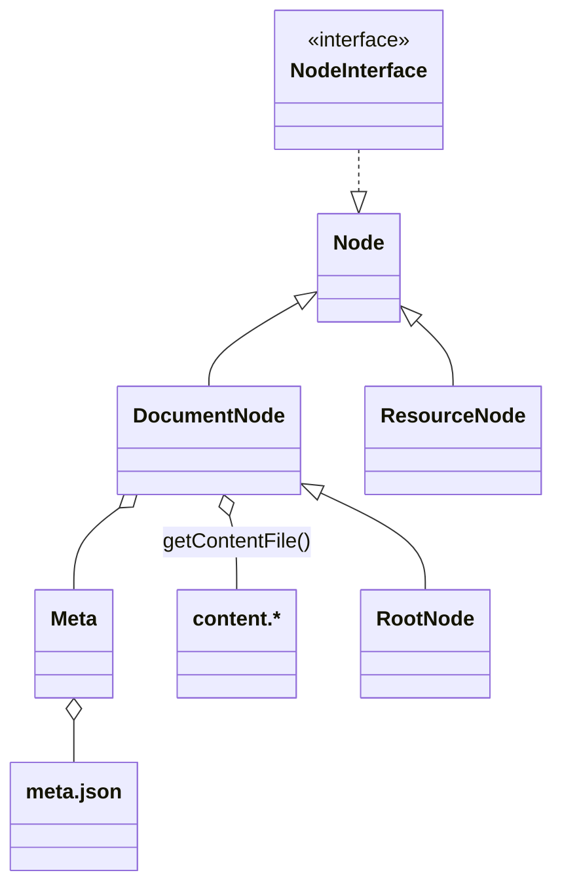
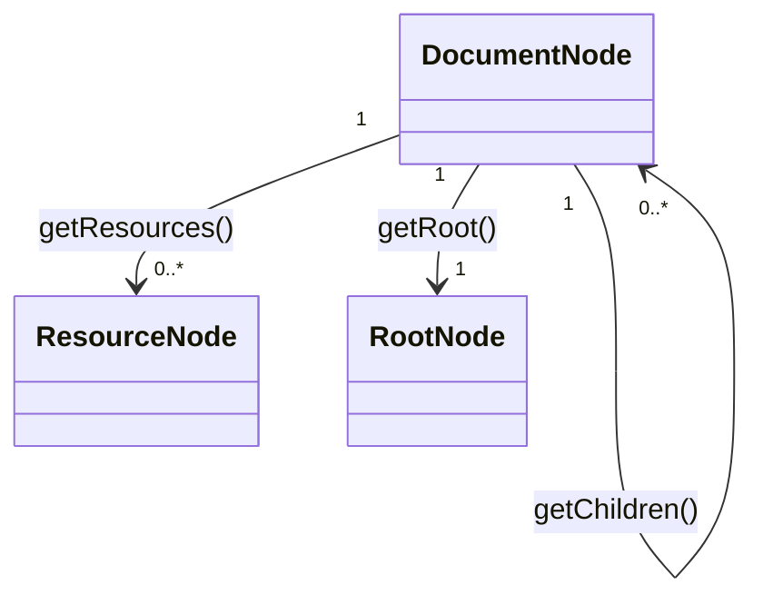

# Volta\Component\Books - Libraries

In this chapter, we will explain the basic building blocks of the Volta Books Component. 

## Domain Model
As explained in previous chapters the content of a page/chapter resides in a file called `content.*` where the name of the directory is the name of the page or chapter. Adjacent to the content file a valid json file named `meta.json` must be present in order to be recognized as a **DocumentNode**. If the **DocumentNode** does not have a parent, it will be a considered a special Document Node: a **RootNode**. All other files are considered **ResourceNodes** 

 
- All **DocumentNodes** in a **Book** point to the same **RootNode**, 
- A **DocumentNode** has none or more **ResourceNodes**
- A **DocumentNode** has none or more (child)**DocumentNodes**

Content files come in different flavors. The format of the content will be set by the extension of the content file. A content parser is needed for each type content. 

