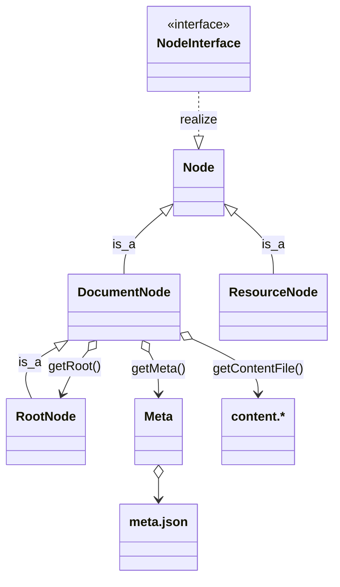
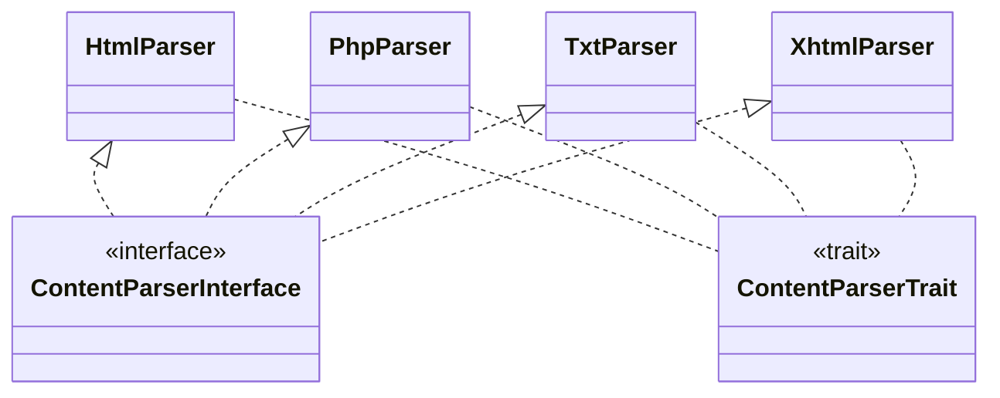

# Volta\Component\Books - Libraries

In this chapter, we will explain the basic building blocks of the Volta Books Component. 

## Domain Model
As explained in previous chapters the content of a page/chapter resides in a file called `content.*` where the name of the directory is the name of the page or chapter. Adjacent to the content file a valid json file named `meta.json` must be present in order to be recognized as a **DocumentNode**. If the **DocumentNode** does not have a parent, it will be a considered a special Document Node: a **RootNode**. All other files are considered **ResourceNodes** 

 
- A **DocumentNode** has none or more (child)**DocumentNodes**
- A **DocumentNode** has none or more **ResourceNodes**
- All **DocumentNodes** in a **Book** point to the same **RootNode**,

Content files are available in various formats, with the content type being determined by the extension of each respective file.

- **txt**: text/plain
- **html**: text/html
- **php**: PHP will be parsed and text/html will be returned
- **xhtml**`: The XML is red and special XML elements will be parsed and text/xhtml is returned

Every content type requires a dedicated content parser. The provided list outlines the pre-built parsers; however, it can be expanded to include custom parsers as well. These parsers must adhere to the **ContentParserInterface** and can optionally make use of the **ContentParserTrait**. As this is done in the Volta-Application with a MarkDown Content parser.

>
> __NOTE:__
> The aforementioned MarkdownParser cannot be integrated into this component due to its dependency on an external module. Which is against the Volta Component guidelines.
> 

## XhtmlParser

The XhtmlParser needs some extra attention. When creating XHTML content, it is possible to add custom elements. These elements need to be in their own namespace, and each element needs to have a corresponding PHP class definition where the class extends the `Volta\Component\Books\ContentParsers\XhtmlParser\Element` class. When the parser encounters a custom element, a new instance is created and the following handlers will be called on this instance while translating the contents of this element:

- onTranslateStart(): string
- onTranslateData(string $data) : string
- onTranslateEnd(): string

All of them expecting a string to be returned which will be added to the result of the parsing process.